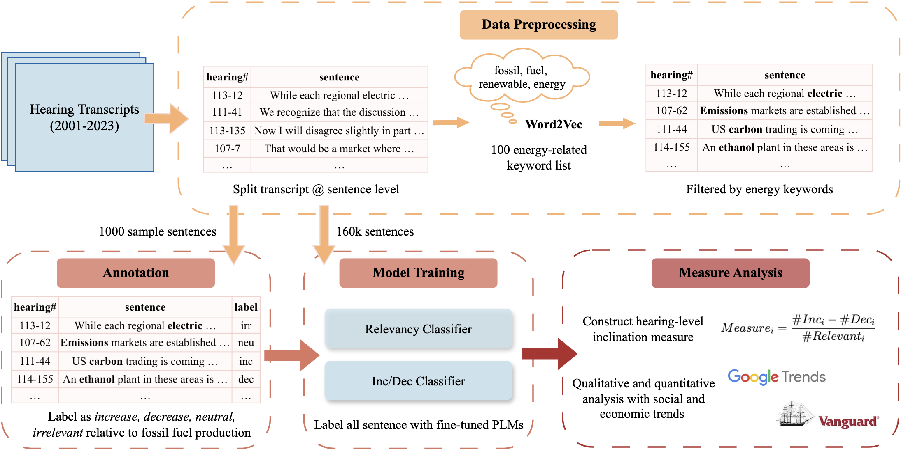

# CoCoHD (Congress Committee Hearing Dataset) Case Study: Quantifying Energy Policy Inclination.

This repo contains the necessary code and data to reproduce the results we got in our Energy and Commerce Committee case study. Specifically, this study examines how the Energy and Commerce Committee hearings either support or discourage the usage of fossil fuels and clean energy. The figure below demonstrates our complete analysis pipeline.  

## Dataset
Please download the CoCoHD dataset from Huggingface. Three datasets are currently available:
* [Hearing transcripts](https://huggingface.co/datasets/gtfintechlab/CoCoHD_transcripts): contains 30k+ hearing transcripts in txt format from 1997 to 2023. 
* [Hearing details](https://huggingface.co/datasets/gtfintechlab/CoCoHD_hearing_details): details for each hearing in JSON format. 
* [Hearing details (cleaned)](https://huggingface.co/datasets/gtfintechlab/CoCoHD_hearing_details_cleaned): details for each hearing in one Pandas dataframe. Past committees names mapped to the latest names; invalid held_date removed; errorneous records removed. 

## Data Collection
We scrape our dataset from [GovInfo](https://www.govinfo.gov/app/collection/chrg/). First step in our data collection process is to collect the links to the hearing transcript and hearing details for each hearing. Once we have a metadata file of the above information, we collect hearing transcripts and hearing details separately. 

To update the dataset with the latest hearings, run `sh collect_congress_no.sh <congress_no>` within the data_collection folder. For example, to get the hearing details and transcripts for all hearings of the 118th Congress, run `sh collect_congress_no.sh 118`. Make sure to have Selenium installed in your environment. 

To reproduce the entire dataset, run `python scrape_hearings.py` first and then run `python scrape_transcripts.py` and `python scrape_details.py` in any order.

## Data Cleaning
Scripts in the data cleaning folder help conduct preliminary data cleaning and preprocessing before doing further analysis of the sentences. The steps include converting text transcripts into pandas data frames using regex and text manipulation expressions, splitting the discourse into sentence units, as well as filtering based on the proposed energy-related keyword list. Future researchers interested in conducting similar case studies with our dataset can also refer to the data cleaning scripts to further prepare our dataset for their specific research goals.  

## Exploratory Analysis
This folder contains a notebook that we used for exploratory data analysis during the initial phase of our study. Although no direct conclusions can be made from this script, it can provide useful insights into congressional hearing patterns and specifically how the Energy and Commerce Committee operates.

## Classification
In this folder, we organize all the code we used for fine-tuning pre-trained language models to extend our manual annotations to the complete dataset. We train two classifiers in this stage: a relevancy classifier and an inc/dec classifier, employing two PLMs, RoBERTa-base and RoBERTa-large. The labeled data used for model training as well as the training results, including hyperparameter search results and testing/training metrics, are being reported in the data folder. 

## Market Analysis
We present the notebook that generates the final statistics and findings in our paper in this folder. However, it also contains many exploratory analyses we made along the way that explain and support our decisions such as threshold selections, market feature calculations, and correlation evaluations. Running this notebook from end-to-end will help reproduce the findings in our paper and also gain a deeper understanding of many interesting aspects/figures that are not detailed in the paper.
